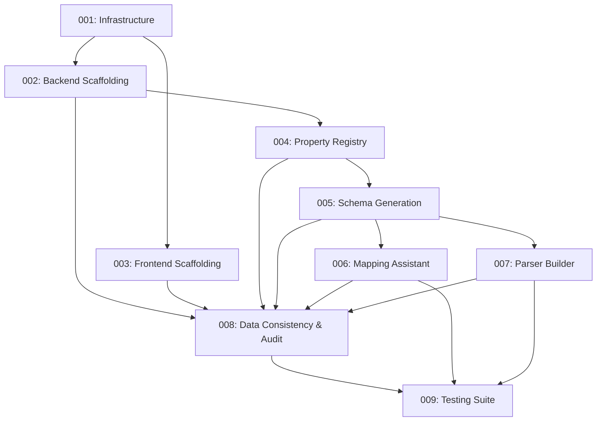

# spec2cloud Task Breakdown

This directory contains the comprehensive task breakdown for the spec2cloud project, an AI-powered laboratory data harmonization platform for Henkel's Connected Lab Platform (CLP).

---

## Task Files

### **Scaffolding Tasks** (Must Complete First)

- **[001-task-infrastructure-scaffolding.md](001-task-infrastructure-scaffolding.md)**
  - Azure infrastructure (Bicep templates, SQL, Cosmos DB, Blob Storage, Functions, Static Web Apps)
  - Monitoring and alerting
  - Database schemas
  - Security configuration

- **[002-task-backend-scaffolding.md](002-task-backend-scaffolding.md)**
  - Python Azure Functions project structure
  - AI Service Adapter (Microsoft Foundry + Azure OpenAI)
  - Shared libraries (database, config, validators, logging)
  - Sample API endpoints

- **[003-task-frontend-scaffolding.md](003-task-frontend-scaffolding.md)**
  - React/TypeScript with Azure Fluent UI
  - API client with React Query
  - Main layout and common components
  - Azure Static Web Apps deployment

### **Feature Implementation Tasks**

- **[004-task-property-registry.md](004-task-property-registry.md)**
  - Property Registry REST API (CRUD, search, bulk operations)
  - Azure SQL database with seed data
  - Frontend UI (list, detail, create/edit forms)

- **[005-task-schema-generation.md](005-task-schema-generation.md)**
  - File parsing (TXT, CSV, Excel with German text, cryptic notation)
  - AI property matching with confidence scoring
  - JSON Schema generation (CLP-compatible)
  - Frontend wizard (3-step: upload → review → export)

- **[006-task-mapping-assistant.md](006-task-mapping-assistant.md)**
  - Two-stage mapping (raw → schema, schema → Albert)
  - Unit conversion and validation
  - CLP export format
  - Frontend mapping review UI

- **[007-task-parser-builder.md](007-task-parser-builder.md)**
  - File structure analysis
  - AI parser code generation (Python/YAML)
  - Azure Document Intelligence for PDFs
  - Parser repository management

- **[008-task-data-consistency-audit.md](008-task-data-consistency-audit.md)**
  - Validation rules engine
  - Application Insights logging
  - Audit log storage and querying
  - Azure Monitor alerts
  - Frontend Audit Log Viewer

### **Quality Assurance**

- **[009-task-testing-suite.md](009-task-testing-suite.md)**
  - Backend unit tests (pytest, ≥85% coverage)
  - Frontend unit tests (Vitest, ≥85% coverage)
  - Integration tests with live Azure services
  - AI accuracy validation
  - E2E tests (Playwright)
  - Performance and security tests

### **Summary Document**

- **[TASK_SUMMARY.md](TASK_SUMMARY.md)**
  - Complete task execution sequence
  - Critical path analysis
  - Parallelization opportunities
  - Timeline estimates (38-40 days realistic)
  - Risk management
  - Success criteria

---

## Task Dependencies

---

## How to Use These Tasks

### **For Product Owners / Project Managers:**
1. Review [TASK_SUMMARY.md](TASK_SUMMARY.md) for timeline and resource planning
2. Prioritize tasks based on business value (critical path already identified)
3. Track progress using acceptance criteria in each task file
4. Monitor risks and adjust plan as needed

### **For Developers:**
1. Start with **001-infrastructure** to set up Azure resources
2. Complete scaffolding tasks (002, 003) before feature work
3. Implement features in order: 004 → 005 → 006 → 007 → 008
4. Follow acceptance criteria and testing requirements in each task
5. Maintain ≥85% test coverage throughout development

### **For Architects:**
1. Review technical requirements in each task for consistency
2. Validate AI Service Adapter pattern supports both Foundry and Azure OpenAI
3. Ensure security best practices (Managed Identity, Key Vault)
4. Verify performance targets are achievable with chosen architecture

---

## Task Standards

Each task file includes:
- **Task ID**: Sequential number for tracking
- **Feature**: Related FRD reference
- **Priority**: Critical / High / Medium
- **Estimated Complexity**: High / Medium / Low
- **Dependencies**: List of prerequisite tasks
- **Sub-Tasks**: Breakdown of work items
- **Acceptance Criteria**: Measurable, testable conditions for completion
- **Testing Requirements**: Specific tests required (unit, integration, E2E)
- **Estimated Effort**: Days required for completion

---

## Key Technologies

### **Backend**
- Azure Functions (Python 3.11+)
- Azure SQL Database
- Azure Cosmos DB (Gremlin API)
- Azure Blob Storage
- Microsoft Foundry OR Azure OpenAI Service
- Application Insights

### **Frontend**
- React 18 + TypeScript
- Azure Fluent UI
- React Query (TanStack Query)
- Vite (build tool)
- Azure Static Web Apps

### **AI/ML**
- Microsoft Foundry (GPT-5.1, o4-mini) - Internal platform development
- Azure OpenAI (GPT-4o, GPT-4.1-mini) - Customer deployment
- AI Service Adapter pattern for pluggable backends

### **Infrastructure as Code**
- Azure Bicep templates
- GitHub Actions (CI/CD)

---

## Success Metrics

### **Performance**
- Schema generation: <4 hours (vs. weeks currently)
- API response time: <500ms (p95)
- File upload: 50MB in <30s
- Page load: <2s

### **Quality**
- Test coverage: ≥85% (backend and frontend)
- AI accuracy: Schema 90%, Mapping 85%, Parser 90%
- Zero security vulnerabilities
- WCAG AA accessibility compliance

### **Business**
- Time-to-onboard new test type: 6 months → 2-4 weeks
- Property naming consistency: 100%
- Manual mapping errors reduced: 80%

---

## Contact & Support

For questions about task breakdown:
- **Product Requirements**: See `/workspaces/spec2cloud/specs/prd.md`
- **Feature Details**: See `/workspaces/spec2cloud/specs/features/*.md`
- **Sample Data**: See `/workspaces/spec2cloud/samples/lap-shear/`

---

**Created**: November 24, 2025  
**Workflow**: PM Agent & Developer Agent (spec2cloud)  
**Status**: Ready for Implementation
